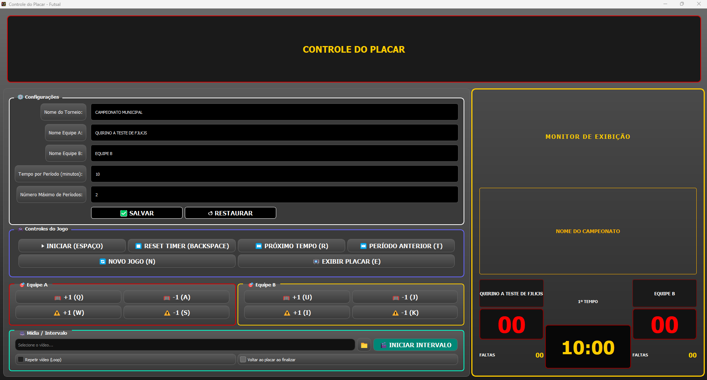
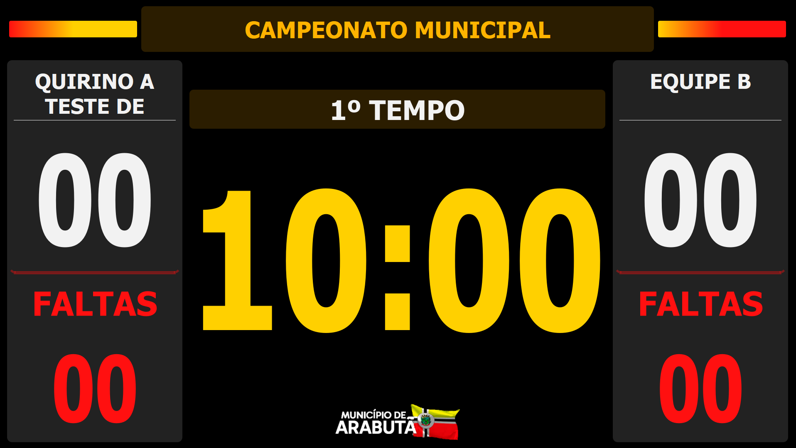

<div align="center">
  
  <h1>Placar Futsal</h1>
  <p><strong>Sistema de gerenciamento e exibição de placar eletrônico em tempo real com suporte a múltiplos monitores.</strong></p>

  <!-- Badges informativas -->
  
  
  
  
  
  
</div>

---

## Visão Geral

O **Placar Futsal** é uma aplicação desktop desenvolvida em **Python** com **PyQt5**, criada para modernizar e profissionalizar o controle de partidas e campeonatos municipais de futsal.

O software foi projetado com arquitetura de **dupla tela (Dual Monitor)**:

- **Painel Administrativo / Operador:** Tela dedicada para o mesário/operador com controle completo de cronômetro, faltas, períodos, nomes das equipes e atalhos rápidos via teclado.
- **Placar de Exibição (Público):** Janela em tela cheia projetada na TV ou telão do ginásio, com alto contraste, tipografia de grande porte e atualização visual em tempo real.

O projeto conta ainda com integração nativa ao **VLC Media Player**, permitindo execução de vídeos de intervalo/mídia institucional e efeitos sonoros sincronizados.

---

## Demonstração Visual

### Painel de Controle (Tela do Operador)

> Interface rica com atalhos de teclado ágeis, configuração de períodos e monitoramento em miniatura.



<br>

### Monitor de Exibição (Tela Cheia / Telão do Público)

> Projeção de alta visibilidade e fidelidade visual para torcedores, atletas e comissão técnica.



---

## Principais Funcionalidades

- **Gerenciamento em Tempo Real:** Controle de tempo regulamentar, pausa, acréscimos, períodos e contagem de faltas por equipe.
- **Operação por Teclado:** Conjunto completo de atalhos rápidos (`Espaço`, `Backspace`, `Q`, `A`, `U`, `J`, etc.) para agilidade imediata do operador durante lances rápidos.
- **Suporte Multi-Monitor:** Detecção automática e projeção em tela cheia para saídas HDMI/VGA independentes.
- **Mídia & Intervalos com VLC:** Suporte a exibição de vídeos promocionais e avisos em loop durante os intervalos de jogo.
- **Compilação Otimizada:** Build standalone nativo compilado com **Nuitka** (gerando código C para performance e proteção do código-fonte) e empacotado via **Inno Setup**.

---

## Arquitetura & Estrutura do Projeto

O projeto adota uma **Arquitetura Modular em Camadas**, com componentização visual e separação rigorosa entre camada de interface, persistência de dados e automação de build:

```text
├── assets/                  # Recursos visuais e estáticos
│   ├── data/                # Dados locais e configurações de apoio
│   ├── images/              # Ícones, logótipos e imagens da aplicação
│   └── styles/              # Folhas de estilo QSS/CSS para theming desacoplado
├── dist_installer/          # Artefactos finais gerados (Instalador .exe e arquivos comprimidos)
├── src/                     # Código-fonte principal
│   ├── components/          # Componentes modulares reutilizáveis de lógica visual
│   ├── database/            # Camada de dados e persistência
│   ├── views/               # Telas principais (Painel do Operador e Placar Público)
│   └── widgets/             # Widgets gráficos customizados em PyQt5
├── build_nuitka.py          # Script de automação de compilação em C nativo
├── nuitka.ini               # Parâmetros de otimização e flags do compilador Nuitka
├── PlacarFutsal.iss         # Script do Inno Setup para geração do instalador Windows
├── pyproject.toml           # Gestão de dependências e metadados do projeto
└── main.py / run.py         # Entrypoint e inicialização do ciclo de vida da aplicação

```

---

## Tecnologias & Ferramentas

- **Linguagem:** Python 3.10+ (validado até 3.14)
- **Interface Gráfica (GUI):** PyQt5
- **Player Multimídia:** `python-vlc` integrado às DLLs nativas do VLC Media Player (64-bit)
- **Compilação C/Python:** Nuitka (gera binário nativo de alto desempenho)
- **Gerador de Instalador:** Inno Setup (empacotador `.exe` com assistente de instalação)

---

## Requisitos do Sistema

- **Sistema Operacional:** Windows 10 ou superior (64-bit)
- **Resolução Recomendada:** Display duplo com suporte a 1920x1080 (Full HD)
- **Dependência Externa (Ambiente de Build):** VLC Media Player 64-bit instalado no sistema operacional (utilizado na extração das DLLs e plugins nativos de decodificação de vídeo durante o build).

---

## Licenciamento & Confidencialidade

> **Nota de Confidencialidade:** Este software foi concebido e implementado sob encomenda institucional. O repositório atua como apresentação técnica e estudo de caso de engenharia de software; o código-fonte proprietário e os binários distribuíveis são de posse exclusiva da entidade promotora.
